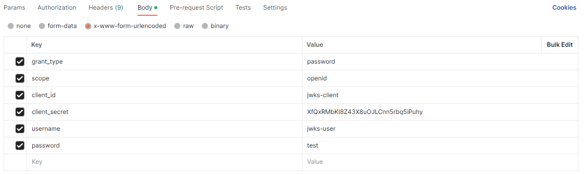
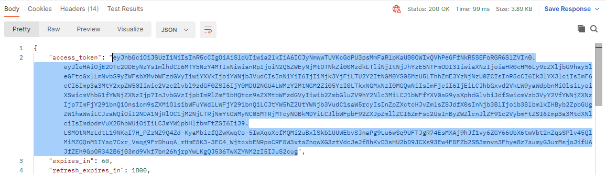
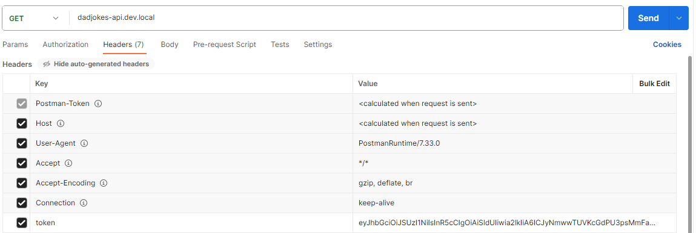

# JWKS LAB GUIDE
In this lab, we update an existing API to enforce additional security by applying a JWT policy.

Instead of using a local secret to verify the client request such as in the previous lab, we will define an external Identity Provider (IdP) using the `JwksURI` field.

We will be using a deployment of [KeyCloak](https://www.keycloak.org/) to work as our IdP in this example.
In this example, KeyCloak is deployed as a single container in the K8s environment.  Upon completion of this lab, the NGINX+ Ingress Controller will now be providing JWT enforcement of the dadjokes API exposed to an outside client via a VirtualServer resource.

# Section 1 - Configure Keycloak

To set up Keycloak:
1. To connect to Keycloak, from the RDP session, open a web browser and connect to `https://keycloak.dev.local`.  There are also bookmarks in chrome and firefox.  

2. Click on Administration Console and login with admin:admin.  Please note that we will be doing all of the work in the master realm.  

3. Create a new Client called `jwks-client`. This can be done by selecting the `Client`s tab on the left and then selecting `Create client`.
   - When creating the Client, ensure both `Client authentication` and `Authorization` are enabled.

4. Once the client is created, navigate to the `Credentials` tab for that client and copy the client SECRET into a vscode file.  This client SECRET will be utilized later for getting the client token.  
   - <Optional>
      This can be saved as a `SECRET` variable in Postman for later use.

5. Create a new User called `jwks-user` by selecting the Users tab on the left and then selecting Create client.

6. Once the user is created, navigate to the `Credentials` tab for that user and select `Set password`. For this example the password can be whatever you want.  This user PASSWORD will be utilized later for getting the client token
   - <Optional>
      This can be saved as a `PASSWORD` variable in Postman for later use.


# Section 2 - Deploy JWT Policy for dadjokesapi
1. In your K8s environment as user01, create a policy with the name jwt-policy-keycloak and configure the JwksURI field so that it only permits requests to our web application that contain a valid JWT. In the example policy below, replace <your_realm> we are working in. We used master as our realm name. The value of spec.jwt.token is set to $http_token in this example as we are sending the client token in an HTTP header.
```
su - user01
cd /home/user01/oidc-lab/jwks-keycloak
nano jwt-keycloak-policy.yaml
```
``` yaml
apiVersion: k8s.nginx.org/v1
kind: Policy
metadata:
  name: jwt-policy-keycloak
  namespace: dadjokes
spec:
  jwt:
    realm: MyProductAPI
    token: $http_token
    jwksURI: http://keycloak.default.svc.cluster.local:8080/realms/<your_realm>/protocol/openid-connect/certs
    keyCache: 1h

```
2. Deploy the policy:
```
kubectl apply -f jwt-keycloak-policy.yaml
```

# Section 3 - Deploy a config map with a resolver
If the value of jwksURI uses a hostname, the Ingress Controller will need to reference a resolver. This can be done by deploying a ConfigMap with the resolver-addresses data field. 

```
nano nginx-config.yaml
```
``` yaml
kind: ConfigMap
apiVersion: v1
metadata:
  name: nginx-config
  namespace: nginx-ingress
data:
  resolver-addresses: "kube-dns.kube-system.svc.cluster.local"
```
In this example, we create a ConfigMap using Kubernetes' default DNS `kube-dns.kube-system.svc.cluster.local` for the resolver address. For more information on `resolver-addresses` and other related ConfigMap keys, please refer to our documentation [ConfigMap Resource](https://docs.nginx.com/nginx-ingress-controller/configuration/global-configuration/configmap-resource/#summary-of-configmap-keys) and our blog post [Using DNS for Service Discovery with NGINX and NGINX Plus](https://www.nginx.com/blog/dns-service-discovery-nginx-plus)

```
kubectl apply -f nginx-config.yaml
```
## Section 3 - Update Load Balancing

1. Review the existing virtual server configuration for the dadjokes API.  Note that there are no JWT policies under the spec of the virtual server.

```
kubectl describe virtual-server dad-jokes-virtualserver -n dadjokes
```

2. Confirm access to the dad jokes API.  
- Open Firefox and click on the dad jokes bookmark.
- Open Postman and perform a GET request to dadjokes-api.dev.local

3. Update the virtual server configuration to enforce JWT token access.

```
nano dadjokes-vs-jwt.yaml
```
``` yaml
##################################################################################################
# CREATE VIRTUALSERVER - dadjokes
##################################################################################################
---
apiVersion: k8s.nginx.org/v1
kind: VirtualServer
metadata:
  name: dad-jokes-virtualserver
  namespace: dadjokes
spec:
  host: dadjokes-api.dev.local
  policies:
  - name: jwt-policy-keycloak
  upstreams:
  - name: dad-jokes
    service: dad-jokes-svc
    port: 80
  routes:
    - path: /
      action:
        pass: dad-jokes  
```

```
kubectl apply -f dadjokes-vs-jwt.yaml
```

Note that the VirtualServer references the policy `jwt-policy-keycloak` created previously.

## Section 4 - Validate and Test

1. Confirm access to the dad jokes API.  Requests should now fail with a 401 unauthorized HTTP status code message.
- From Firefox and click on the dad jokes bookmark.
- From Postman and perform a GET request to dadjokes-api.dev.local

2. Get the client token using postman.
- Create a POST request to keycloak.  Ensure to replace the your_realm in the URI with either the realm you created earlier or master.

https://keycloak.dev.local/realms/<your_realm>/protocol/openid-connect/token

In the body of the post request you will need to setup the following key value pairs.  Note `SECRET` and `PASSWORD` should be saved in a vscode file or as a POSTMAN variable from a previous step.

Key             Value
grant_type      password
scope           openid
client_id       jwks-client
client_secret   `SECRET`
user            jwks-user
password        `PASSWORD`



Upon successful post, in the body of the response you will get an access token.  Copy the token text (NOTE: Do not copy the quotation marks).



3. Send a new GET request to dadjokes-api.dev.local with the jwt token you just copied.

Click on the Headers section and add a new key value pair.  Use the copy text string from the previous step as your token value.

Key             Value
token           `ACCESS_TOKEN`



You should now be able to successfully access the API.  NOTE: the access token in this environment will expire after a short time.  Try the GET request again in about 5 mins with your initial token and you will get a 401 response.  This means that the JWT has expired.  Repeat the previous steps of getting a new access token and updating your token value which should re-enable access.


## Additional Information
For more information, please visit our github.
https://github.com/nginxinc/kubernetes-ingress/tree/v3.3.1/examples/custom-resources/jwks