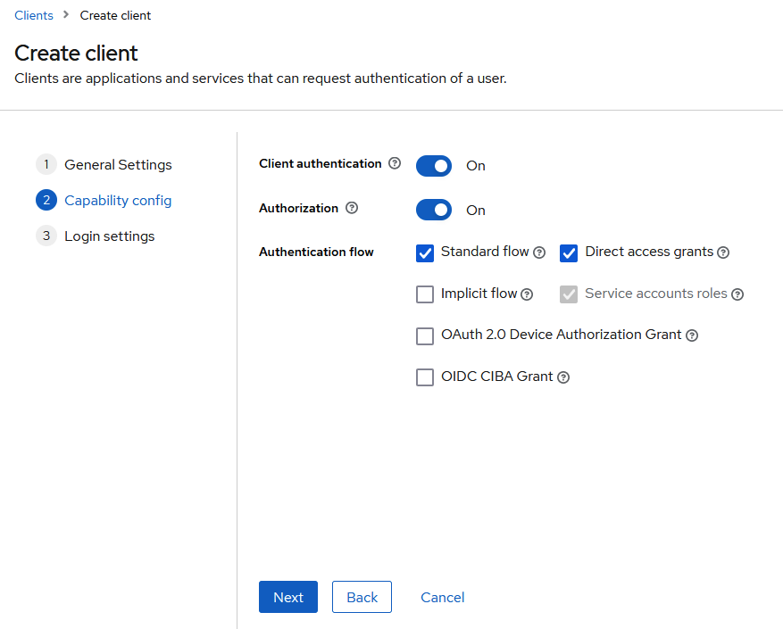
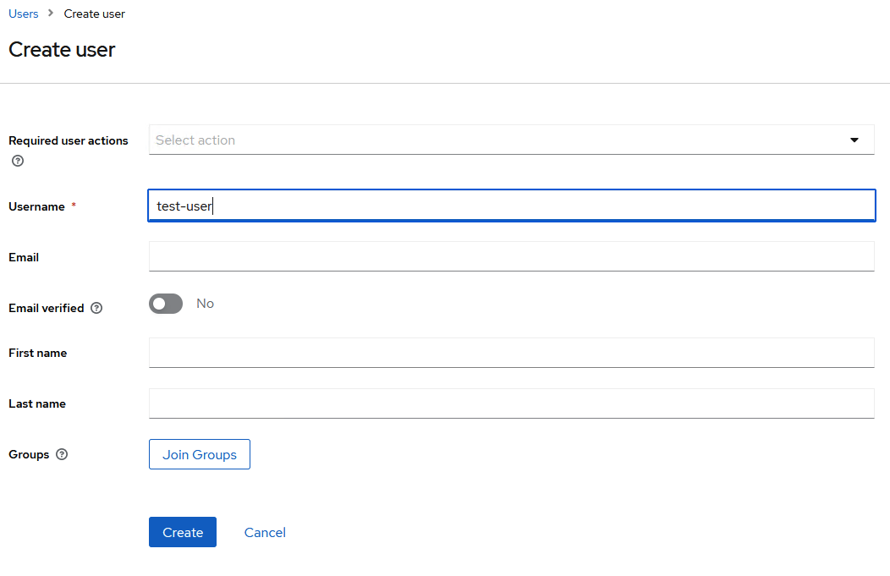
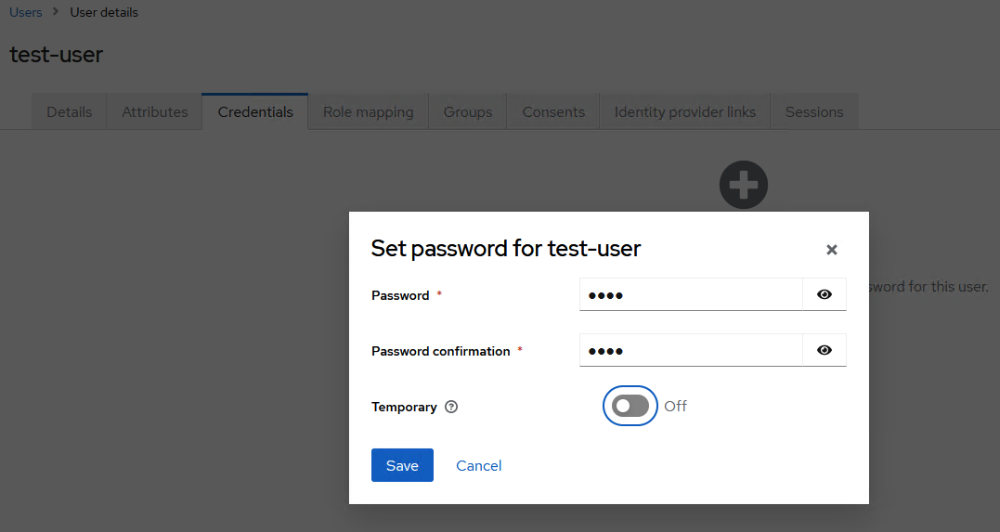
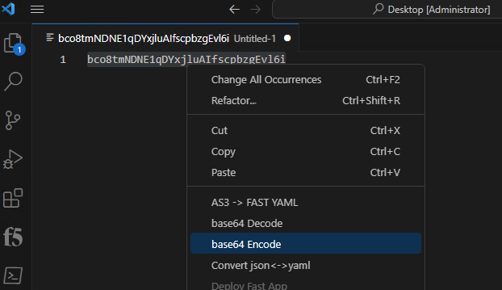

# OIDC LAB GUIDE
In this example, we we update an existing web application with additional security protection by using an OpenID Connect policy and [Keycloak](https://www.keycloak.org/).

# Section 1 - Update Ingress Controller
To customize the NGINX OpenID Connect Reference implementation, you will need to:

- Create a ConfigMap containing the contents of the default oidc.conf file
- Attach a Volume and VolumeMount to your deployment of the F5 NGINX Ingress Controller in order to mount the OIDC file to the NGINX+ Ingress pods.


1. Creating the OIDC ConfigMap.
From the K8s environment as user 01, run the below command to generate a OIDC ConfigMap with the contents of the oidc.conf file. NOTE The ConfigMap must be deployed in the same namespace as the F5 NGINX Ingress Controller.

```
su - user01
kubectl create configmap oidc-config-map --from-literal=oidc.conf="$(curl -k https://raw.githubusercontent.com/nginxinc/kubernetes-ingress/v3.3.1/internal/configs/oidc/oidc.conf)" -n nginx-ingress

```

Use the kubectl describe command to confirm the contents of the ConfigMap are correct.

```
kubectl describe configmap oidc-config-map -n nginx-ingress
```

2. Review existing NGINX Ingress Deployment.  NOTE there are no oidc-volumes in the current NGINX Ingress Deployment.

```
kubectl describe deployment nginx-ingress -n nginx-ingress
```

3. Delete the NGINX Ingress Deployment.  NOTE: upon deletion, external access to K8s applications like cafe, dadjokes, and others will be unavailable.

```
kubectl delete deployment nginx-ingress -n nginx-ingress
```

4. In this step we configure, the DNS resolver, so that an NGINX Plus can resolve the Keycloak endpoint.

Get the cluster IP of the KubeDNS service:
```
kubectl -n kube-system get svc kube-dns
```
SAMPLE OUTPUT
```
NAME       TYPE        CLUSTER-IP      EXTERNAL-IP   PORT(S)                  AGE
kube-dns   ClusterIP   10.152.183.10   <none>        53/UDP,53/TCP,9153/TCP   2d2h
```
Create a new for the DNS resolver ConfigMap, replacing the location of <kube-dns-ip> with the IP obtained in the previous step.
```
nano nginx-config-resolver.yaml
```
``` yaml
kind: ConfigMap
apiVersion: v1
metadata:
  name: nginx-config
  namespace: nginx-ingress
data:
  resolver-addresses: <kube-dns-ip>
  resolver-valid: 5s
```
```
kubectl apply -f nginx-config-resolver.yaml
```

5. In this step we will add a Volume and VolumeMount to the NGINX Ingress Controller deployment. This will allow you to mount the ConfigMap created earlier and overwrite the contents of the oidc.conf file.  We also need to add  command line arguments in the manifest to enable oidc.

Create a new deployment manifest to add the oidc volume and volume mount.  

```

cd /home/user01/oidc-lab/oidc-keycloak
nano nginx-plus-oidc-ingress.yaml
```

``` yaml
apiVersion: apps/v1
kind: Deployment
metadata:
  name: nginx-ingress
  namespace: nginx-ingress
spec:
  replicas: 1
  selector:
    matchLabels:
      app: nginx-ingress
  template:
    metadata:
      labels:
        app: nginx-ingress
        app.kubernetes.io/name: nginx-ingress
      annotations:
        prometheus.io/scrape: "true"
        prometheus.io/port: "9113"
        prometheus.io/scheme: http
    spec:
      serviceAccountName: nginx-ingress
      imagePullSecrets:
      - name: regcred
      automountServiceAccountToken: true
      securityContext:
        seccompProfile:
          type: RuntimeDefault
      volumes:
      - name: oidc-volume
        configMap:
          name: oidc-config-map # Must match the name of the ConfigMap
#      - name: nginx-etc
#        emptyDir: {}
#      - name: nginx-cache
#        emptyDir: {}
#      - name: nginx-lib
#        emptyDir: {}
#      - name: nginx-log
#        emptyDir: {}
      containers:
      - image: private-registry.nginx.com/nginx-ic-nap/nginx-plus-ingress:3.3.1
        imagePullPolicy: IfNotPresent
        name: nginx-plus-ingress
        ports:
        - name: http
          containerPort: 80
        - name: https
          containerPort: 443
        - name: readiness-port
          containerPort: 8081
        - name: prometheus
          containerPort: 9113
        - name: service-insight
          containerPort: 9114
        readinessProbe:
          httpGet:
            path: /nginx-ready
            port: readiness-port
          periodSeconds: 1
        resources:
          requests:
            cpu: "100m"
            memory: "128Mi"
          limits:
            cpu: "1"
            memory: "1Gi"
        securityContext:
          allowPrivilegeEscalation: false
#          readOnlyRootFilesystem: true
          runAsUser: 101 #nginx
          runAsNonRoot: true
          capabilities:
            drop:
            - ALL
            add:
            - NET_BIND_SERVICE
        volumeMounts:
        - name: oidc-volume
          mountPath: /etc/nginx/oidc/oidc.conf
          subPath: oidc.conf # Must match the name in the data filed
          readOnly: true
#        - mountPath: /etc/nginx
#          name: nginx-etc
#        - mountPath: /var/cache/nginx
#          name: nginx-cache
#        - mountPath: /var/lib/nginx
#          name: nginx-lib
#        - mountPath: /var/log/nginx
#          name: nginx-log
        env:
        - name: POD_NAMESPACE
          valueFrom:
            fieldRef:
              fieldPath: metadata.namespace
        - name: POD_NAME
          valueFrom:
            fieldRef:
              fieldPath: metadata.name
        args:
          - -nginx-plus
          - -nginx-configmaps=$(POD_NAMESPACE)/nginx-config
         #- -default-server-tls-secret=$(POD_NAMESPACE)/default-server-secret
         #- -include-year
         #- -enable-cert-manager
         #- -enable-external-dns
          - -enable-app-protect
         #- -enable-app-protect-dos
         #- -v=3 # Enables extensive logging. Useful for troubleshooting.
         #- -report-ingress-status
         #- -external-service=nginx-ingress
          - -enable-prometheus-metrics
          - -enable-oidc
          - -enable-snippets
         #- -enable-service-insight
         #- -global-configuration=$(POD_NAMESPACE)/nginx-configuration
#      initContainers:
#      - image: nginx/nginx-ingress:3.2.1
#        imagePullPolicy: IfNotPresent
#        name: init-nginx-ingress
#        command: ['cp', '-vdR', '/etc/nginx/.', '/mnt/etc']
#        securityContext:
#          allowPrivilegeEscalation: false
#          readOnlyRootFilesystem: true
#          runAsUser: 101 #nginx
#          runAsNonRoot: true
#          capabilities:
#            drop:
#            - ALL
#        volumeMounts:
#        - mountPath: /mnt/etc
#          name: nginx-etc
```

```
kubectl apply -f nginx-plus-oidc-ingress.yaml
```

Confirm that the nginx+ ingress pods are running.  Copy the name of the pod.

```
kubectl get pods -n nginx-ingress
```

Confirm the oidc.conf file exists on the nginx+ ingress pod.

```
kubectl exec -it -n nginx-ingress <name-n+ingess-controller-pod> -- cat /etc/nginx/oidc/oidc.conf
```

# Section 2 - Configure Keycloak

1. To connect to Keycloak, from the RDP session, open a web browser and connect to `https://keycloak.dev.local`.  There are also bookmarks in chrome and firefox.  Click on Administration Console and login with admin:admin.

1. In the left navigation column, click Clients. On the Clients page that opens, click the Create Client button.

1. On the Create Client page that opens, enter or select these values, then click the Next button.

Client ID – The name of the application for which you’re enabling SSO (Keycloak refers to it as the “client”). Here we’re using nginx-plus.
Client type – OpenID Connect.


1. On the Capability config, enable both Client authentication and Authorization.



1. On the login settings page, add https://cafe.dev.local:443/_codexch to the valid redirect URLs and click Save.  This will allow for the cafe webapp to redirect to Keycloak for the user login process.


1. On the NGINX Plus page that opens, click the Credentials tab and make a note of the value in the Secret field. 


1. Make sure to save the client secret for NGINX-Plus client to the `SECRET` a new VS code file.  You will need to for later in the lab.

1. In the Keycloak left navigation column, click Users. On the Users page that opens, click the Add user button. 

1. Create a username.  Here we use test-user.



1. On the test-user page that opens, click the Credentials tab.  Click set password.  Update the Password.  Make sure you have the Temporary password field turned to off. Save.



# Section 3 - Deploy the Client Secret

1. Encode the secret, obtained in the previous section. Go to the VSCode file where the secret was copied too.  You will need to encode this secret to base64.  

###NOT WORKING### Highlight the entire secret and right click.  You will see a base64 Encode option.  Proceed to encode the secret. (NOTE: Your VScode will need The F5 Extension and PowerShell extensions installed.)

VS Code not working - you can utilize a website to copy the SECRET and get it base64 encoded.  https://www.base64encode.org/



1. In your K8s environment, you will then create a client-secret.  Create client-secret.yaml, replacing <insert-secret-here>  with the base64 encoded secret.

``` 
nano client-secret.yaml
```

``` yaml
apiVersion: v1
kind: Secret
metadata:
  name: oidc-secret
  namespace: cafe
type: nginx.org/oidc
data:
  client-secret: <insert-secret-here>
```
1. Create a secret with the name oidc-secret that will be used by the OIDC policy.

```
kubectl apply -f client-secret.yaml
```

# Section 4 - Deploy the OIDC policy
1. Create a policy with the name oidc-policy that references the secret from the previous step:
``` 
nano oidc-policy.yaml
```
```yaml
apiVersion: k8s.nginx.org/v1
kind: Policy
metadata:
  name: oidc-policy
  namespace: cafe
spec:
  oidc:
    clientID: nginx-plus
    clientSecret: oidc-secret
    authEndpoint: https://keycloak.dev.local/realms/master/protocol/openid-connect/auth
    tokenEndpoint: http://keycloak.keycloak.svc.cluster.local:8080/realms/master/protocol/openid-connect/token
    jwksURI: http://keycloak.keycloak.svc.cluster.local:8080/realms/master/protocol/openid-connect/certs
    scope: openid+profile+email
    accessTokenEnable: true
```
``` 
kubectl apply -f oidc-policy.yaml
```

1. Note these endpoints can be retrieved by doing a GET request to the keycloak authentication endpoints:
curl -X GET \
  http://${host}:${port}/realms/${realm}/.well-known/openid-configuration 

We had to make some changes to the tokenEndpoint and jwksURI to reference the internal K8s DNS name.  

In our enviornment you can use Postman and create a Get request to the following URL.  Note: we are using the master realm in our lab. 
https://keycloak.dev.local/realms/master/.well-known/openid-configuration


# Section 5 - Update Load Balancing
1. Review the existing virtual server configuration for the cafe web app.  Note that there are no OIDC policies under the spec of the virtual server.

```
kubectl describe virtualserver cafe-vs -n cafe
```
2. Confirm access to the cafe web.  
- Open Chrome/Firefox and click on the cafe bookmark.

3. Update the virtual server configuration to enforce OIDC policy.

```
nano cafe-vs-oidc.yaml
```

``` yaml
##################################################################################################
# CREATE VIRTUALSERVER - cafe
##################################################################################################
---
apiVersion: k8s.nginx.org/v1
kind: VirtualServer
metadata:
  name: cafe-vs
  namespace: cafe
spec:
  host: cafe.dev.local
  policies:
  - name: oidc-policy
  tls:
    secret: cafe-secret
    redirect:
      enable: true  #Redirect from http > https
      code: 301
  upstreams:
  - name: tea
    service: tea-svc
    port: 80
    lb-method: round_robin
    slow-start: 20s
    healthCheck:
      enable: true
      path: /tea
      interval: 20s
      jitter: 3s
      fails: 5
      passes: 2
      connect-timeout: 30s
      read-timeout: 20s
  - name: coffee
    service: coffee-svc
    port: 80
    lb-method: round_robin
    healthCheck:
      enable: true
      path: /coffee
      interval: 10s
      jitter: 3s
      fails: 3
      passes: 2
      connect-timeout: 30s
      read-timeout: 20s
  routes:
  - path: /
    action:
      redirect:
        url: https://cafe.dev.local/coffee
        code: 302  #Redirect from / > /coffee
  - path: /tea
    action:
      pass: tea
  - path: /coffee
    action:
      pass: coffee
```

```
kubectl apply -f cafe-vs-oidc.yaml
```
## Section 6 - Configure DNS Resolver


## Section 7 - Validate and Test

1. Open a new ingonito/private browser and Confirm access to the cafe web app.  You should now be redirected to Keycloak login page.  

2. Login with the test-user ID/PASS you created earlier.  The cafe application is now protected with OIDC.  


## Additional Information
For more information about OIDC with NGINX+ Ingress Controller: https://docs.nginx.com/nginx-ingress-controller/tutorials/oidc-custom-configuration/


For more information on Keycloak:
https://www.keycloak.org/docs/latest/authorization_services/index.html  


For more information, please visit our github: 
https://github.com/nginxinc/kubernetes-ingress/blob/v3.3.1/examples/custom-resources/oidc/README.md
https://docs.nginx.com/nginx/deployment-guides/single-sign-on/keycloak/#configuring-keycloak 